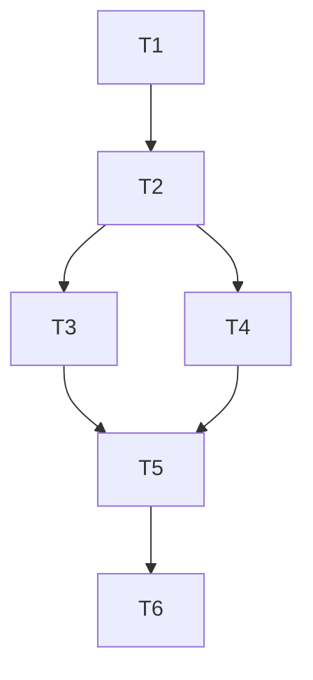

# Dependency Analysis

How to identify and manage dependencies between tasks in multi-agent workstreams.

## Dependency Types

### Hard Dependencies

Task B cannot start until Task A completes.

```yaml
- id: T2
  name: "Implement feature"
  depends_on: [T1]  # Must wait for T1
  dependency_type: hard
```

**Examples:**
- Implementation depends on design
- Tests depend on implementation
- Deployment depends on tests passing

### Soft Dependencies

Task B benefits from Task A but can proceed without it.

```yaml
- id: T2
  name: "Implement feature"
  soft_depends_on: [T1]  # Preferably after T1
  dependency_type: soft
```

**Examples:**
- Documentation can start before implementation finishes
- UI mockups can proceed alongside API design

### Resource Dependencies

Tasks compete for the same resource.

```yaml
- id: T2
  name: "Run integration tests"
  resource_lock: database
  # Cannot run while T1 also uses database
```

**Examples:**
- Multiple tests using same database
- Deployments to same environment
- File locks on shared configs

## Identifying Dependencies

### Question Checklist

For each task, ask:

1. **Input Required**: What information/files does this task need?
2. **Contracts**: What interfaces must be defined first?
3. **Artifacts**: What must be produced by other tasks?
4. **Side Effects**: What state changes affect this task?
5. **Resources**: What shared resources are needed?

### Dependency Matrix

|  | T1 | T2 | T3 | T4 | T5 |
|--|----|----|----|----|----|
| T1 | - | | | | |
| T2 | ● | - | | | |
| T3 | | ● | - | | |
| T4 | | ● | | - | |
| T5 | | | ● | ● | - |

● = T(row) depends on T(column)

### Code Dependency Analysis

```python
# Analyze imports to find dependencies
def find_code_dependencies(file_path):
    """Extract import dependencies from source file."""
    dependencies = []
    with open(file_path) as f:
        for line in f:
            if line.startswith('import ') or line.startswith('from '):
                # Extract module name
                module = extract_module(line)
                dependencies.append(module)
    return dependencies
```

## Dependency Graph Construction

### From Task List to Graph

```yaml
tasks:
  - {id: T1, name: "Research", depends_on: []}
  - {id: T2, name: "Design", depends_on: [T1]}
  - {id: T3, name: "Implement A", depends_on: [T2]}
  - {id: T4, name: "Implement B", depends_on: [T2]}
  - {id: T5, name: "Integrate", depends_on: [T3, T4]}
  - {id: T6, name: "Test", depends_on: [T5]}
```

Produces graph:



### Critical Path Analysis

The critical path is the longest dependency chain:

```
T1 → T2 → T3 → T5 → T6  (or T1 → T2 → T4 → T5 → T6)
```

Tasks on critical path cannot be parallelized. Focus optimization here.

### Slack Time Calculation

```
Slack = Latest_Start - Earliest_Start
```

Tasks with zero slack are on critical path.

```yaml
task_timing:
  T1: {earliest: 0, latest: 0, slack: 0}  # Critical
  T2: {earliest: 1, latest: 1, slack: 0}  # Critical
  T3: {earliest: 2, latest: 2, slack: 0}  # Critical
  T4: {earliest: 2, latest: 2, slack: 0}  # Critical (parallel)
  T5: {earliest: 3, latest: 3, slack: 0}  # Critical
  T6: {earliest: 4, latest: 4, slack: 0}  # Critical
```

## Breaking Dependency Chains

### Interface Extraction

Instead of:
```
Implement A → Implement B (B imports from A)
```

Do:
```
Define Interface → Implement A
                → Implement B
```

### Mock Dependencies

```yaml
- id: T3
  name: "Implement feature using API"
  depends_on: [T2]  # Normally waits for API

- id: T3_early
  name: "Implement feature with mock API"
  depends_on: [T2_interface]  # Can start earlier with mock
```

### Incremental Delivery

Break large tasks into smaller deliverables:

```yaml
# Instead of:
- id: T1
  name: "Implement entire user system"
  estimated: 8h

# Do:
- id: T1a
  name: "Implement user model"
  estimated: 2h
- id: T1b
  name: "Implement user service"
  depends_on: [T1a]
  estimated: 2h
- id: T1c
  name: "Implement user API"
  depends_on: [T1b]
  estimated: 2h
- id: T1d
  name: "Implement user tests"
  depends_on: [T1c]
  estimated: 2h
```

## Cycle Detection

Circular dependencies must be broken:

```
T1 → T2 → T3 → T1  # INVALID
```

### Detection Algorithm

```python
def detect_cycles(tasks):
    """Find circular dependencies."""
    visited = set()
    rec_stack = set()

    def dfs(task_id):
        visited.add(task_id)
        rec_stack.add(task_id)

        for dep in get_dependents(task_id):
            if dep not in visited:
                if dfs(dep):
                    return True
            elif dep in rec_stack:
                return True  # Cycle found!

        rec_stack.remove(task_id)
        return False

    for task in tasks:
        if task.id not in visited:
            if dfs(task.id):
                return True
    return False
```

### Breaking Cycles

1. **Find the cycle**: T1 → T2 → T3 → T1
2. **Identify weakest link**: Which dependency is least critical?
3. **Extract interface**: Create abstraction that both can depend on
4. **Reorder**: Change which task comes first

## Dependency Documentation

```yaml
dependency_record:
  - from: T3
    to: T2
    type: hard
    reason: "T3 implements the interface designed in T2"
    artifacts: ["api_contract.yaml"]

  - from: T5
    to: [T3, T4]
    type: hard
    reason: "Integration requires both components"
    artifacts: ["user_service.py", "auth_middleware.py"]
```

## Validation Checklist

- [ ] All dependencies point to existing tasks
- [ ] No circular dependencies
- [ ] Critical path identified
- [ ] Soft vs hard dependencies distinguished
- [ ] Resource conflicts documented
- [ ] Dependency reasons explained
