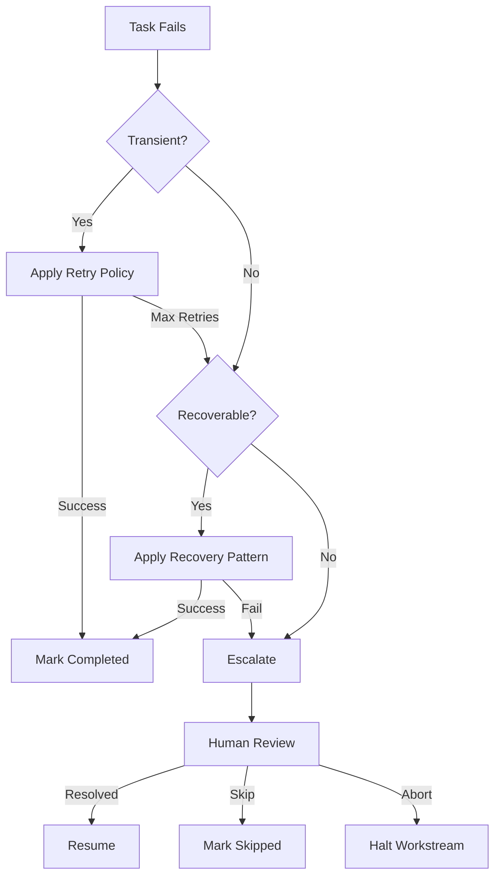

# Failure Recovery Patterns

Strategies for handling failures in multi-agent workstreams.

## Failure Types

### Transient Failures

Temporary issues that may resolve on retry.

```yaml
transient_failures:
  - network_timeout
  - rate_limit_exceeded
  - temporary_service_unavailable
  - file_lock_conflict

recovery: retry_with_backoff
```

### Persistent Failures

Issues requiring intervention.

```yaml
persistent_failures:
  - invalid_input
  - missing_dependency
  - permission_denied
  - logic_error

recovery: escalate_or_skip
```

### Cascading Failures

Failures that affect dependent tasks.

```yaml
cascading_failures:
  - upstream_task_failed
  - shared_resource_corrupted
  - contract_violation

recovery: halt_dependent_tasks
```

## Retry Strategies

### Simple Retry

```yaml
retry_policy:
  type: simple
  max_attempts: 3
  delay: 5s
```

### Exponential Backoff

```yaml
retry_policy:
  type: exponential_backoff
  max_attempts: 5
  initial_delay: 1s
  max_delay: 60s
  multiplier: 2

# Delays: 1s, 2s, 4s, 8s, 16s
```

### Exponential Backoff with Jitter

```yaml
retry_policy:
  type: exponential_backoff_jitter
  max_attempts: 5
  initial_delay: 1s
  max_delay: 60s
  jitter: 0.5  # ±50% randomization

# Prevents thundering herd
```

### Circuit Breaker

```yaml
circuit_breaker:
  failure_threshold: 5
  reset_timeout: 60s
  half_open_requests: 3

states:
  closed: "Normal operation"
  open: "Failing fast, no attempts"
  half_open: "Testing if recovered"
```

## Recovery Patterns

### Pattern 1: Retry

Same agent retries same task.

```yaml
on_failure:
  action: retry
  policy: exponential_backoff
  max_attempts: 3

implementation:
  - wait for backoff period
  - retry task with same parameters
  - if success: mark completed
  - if max_attempts: escalate
```

### Pattern 2: Reassign

Different agent attempts task.

```yaml
on_failure:
  action: reassign
  reason: "Agent-specific issue suspected"

implementation:
  - save task state
  - assign to different agent instance
  - transfer context/artifacts
  - retry from checkpoint
```

### Pattern 3: Decompose

Break task into smaller subtasks.

```yaml
on_failure:
  action: decompose
  reason: "Task too complex"

original_task:
  id: T1
  name: "Implement full feature"

decomposed_tasks:
  - id: T1a
    name: "Implement data model"
  - id: T1b
    name: "Implement service layer"
  - id: T1c
    name: "Implement API endpoints"
```

### Pattern 4: Skip

Mark as skipped, continue downstream.

```yaml
on_failure:
  action: skip
  conditions:
    - task_is_optional
    - downstream_can_proceed

implementation:
  - mark task as skipped
  - log failure reason
  - notify dependent tasks
  - continue execution
```

### Pattern 5: Escalate

Human intervention required.

```yaml
on_failure:
  action: escalate
  after_attempts: 3

escalation:
  notify: [supervisor, oncall]
  context:
    - task_id
    - failure_reason
    - attempted_recoveries
    - relevant_logs

  await: manual_resolution
```

### Pattern 6: Rollback

Undo completed work.

```yaml
on_failure:
  action: rollback
  reason: "Downstream task revealed issue"

rollback_plan:
  - identify affected files
  - restore from checkpoint
  - invalidate dependent work
  - restart from safe point
```

## Checkpoint Strategy

### Checkpoint Types

```yaml
checkpoints:
  - type: artifact
    trigger: after_task_completion
    save: [created_files, modified_files]

  - type: state
    trigger: periodic
    interval: 10min
    save: [task_state, progress, context]

  - type: milestone
    trigger: phase_completion
    save: [all_artifacts, validation_results]
```

### Checkpoint Implementation

```yaml
checkpoint:
  id: CP-003
  created: "2024-01-15T10:30:00Z"
  phase: "Implementation"

  state:
    completed_tasks: [T1, T2, T3]
    in_progress_tasks: [T4]
    pending_tasks: [T5, T6]

  artifacts:
    - path: src/auth/user.py
      hash: abc123
    - path: src/auth/middleware.py
      hash: def456

  validation:
    tests_passed: true
    lint_clean: true
```

### Recovery from Checkpoint

```yaml
recovery:
  from_checkpoint: CP-003

  steps:
    - restore artifacts to working directory
    - reset task states
    - resume from T4 (was in_progress)
    - maintain downstream pending status
```

## Failure Handling Workflow



## Failure Notification

### Alert Format

```yaml
alert:
  severity: high
  task_id: T4
  agent: Edit
  failure_type: persistent

  summary: "Implementation failed after 3 attempts"

  details:
    error: "Type mismatch in User.authenticate()"
    attempts: 3
    last_attempt: "2024-01-15T10:30:00Z"

  context:
    file: src/auth/user.py
    line: 42

  recovery_attempted:
    - retry: 3 times
    - decompose: not applicable

  recommended_action: "Review type annotations"

  impact:
    blocked_tasks: [T5, T6]
    workstream_delay: estimated 2h
```

### Notification Channels

```yaml
notifications:
  - channel: log
    always: true

  - channel: supervisor
    when: failure_count >= 2

  - channel: oncall
    when: severity == critical

  - channel: dashboard
    always: true
    update_status: true
```

## Best Practices

### Do

- Define retry policies upfront
- Create checkpoints at meaningful boundaries
- Log sufficient context for debugging
- Test recovery paths
- Set clear escalation criteria

### Don't

- Retry indefinitely
- Ignore partial failures
- Lose context between retries
- Skip validation after recovery
- Assume recovered state is correct

### Recovery Checklist

- [ ] Failure identified and categorized
- [ ] Appropriate recovery pattern selected
- [ ] Retry policy applied if transient
- [ ] State saved before recovery attempt
- [ ] Dependent tasks notified
- [ ] Recovery validated
- [ ] Metrics updated
- [ ] Post-mortem if significant
