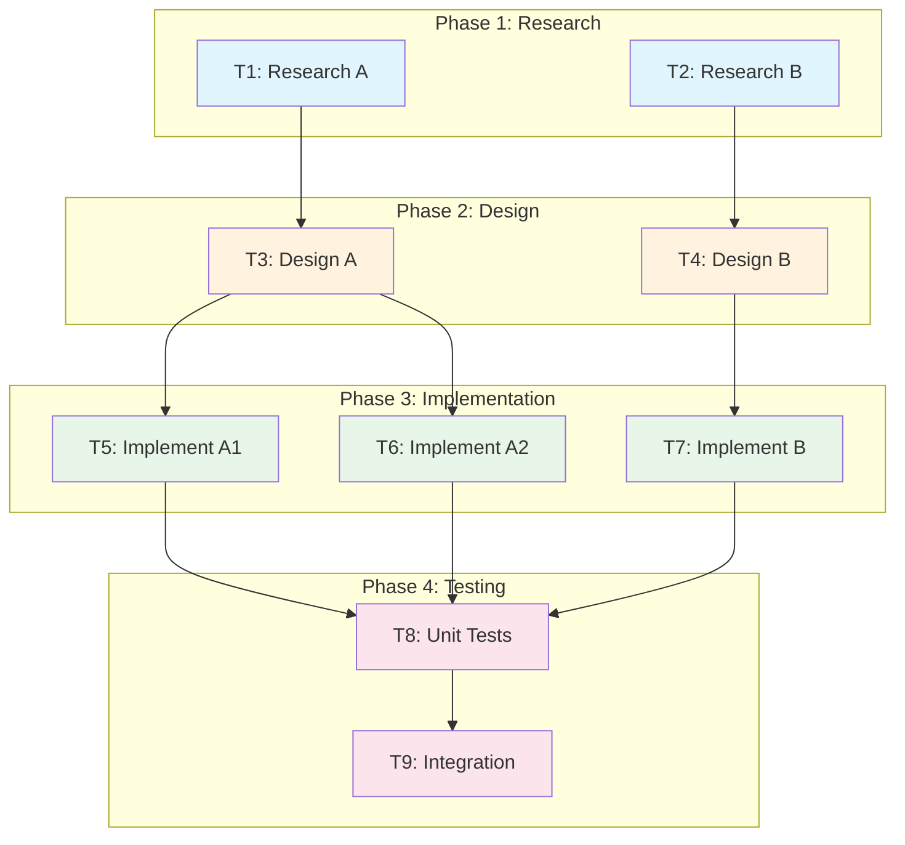

# Dependency Graph: {{FEATURE_NAME}}

> Generated: {{DATE}}

## Visual Graph



## Legend

| Color | Meaning |
|-------|---------|
| Blue | Research/Explore tasks |
| Orange | Design/Plan tasks |
| Green | Implementation/Edit tasks |
| Pink | Testing/Verification tasks |

## Parallel Opportunities

### Level 0 (Entry Points)
```
T1, T2  ← Can start immediately, in parallel
```

### Level 1 (After Research)
```
T3 (after T1)
T4 (after T2)  ← Can run in parallel
```

### Level 2 (After Design)
```
T5, T6 (after T3)
T7 (after T4)  ← All three can run in parallel
```

### Level 3 (After Implementation)
```
T8 (after T5, T6, T7)  ← Must wait for all implementation
```

### Level 4 (After Unit Tests)
```
T9 (after T8)  ← Final integration
```

## Critical Path

```
T1 → T3 → T5 → T8 → T9
        ↘ T6 ↗

Duration: Sum of longest path through graph
```

## Task Details

| ID | Name | Agent | Duration | Depends On | Blocks |
|----|------|-------|----------|------------|--------|
| T1 | Research A | Explore | 15m | - | T3 |
| T2 | Research B | Explore | 15m | - | T4 |
| T3 | Design A | Plan | 30m | T1 | T5, T6 |
| T4 | Design B | Plan | 30m | T2 | T7 |
| T5 | Implement A1 | Edit | 45m | T3 | T8 |
| T6 | Implement A2 | Edit | 45m | T3 | T8 |
| T7 | Implement B | Edit | 45m | T4 | T8 |
| T8 | Unit Tests | Bash | 10m | T5, T6, T7 | T9 |
| T9 | Integration | Bash | 15m | T8 | - |

## Dependency Matrix

|    | T1 | T2 | T3 | T4 | T5 | T6 | T7 | T8 | T9 |
|----|----|----|----|----|----|----|----|----|----|
| T1 | - |   |   |   |   |   |   |   |   |
| T2 |   | - |   |   |   |   |   |   |   |
| T3 | ● |   | - |   |   |   |   |   |   |
| T4 |   | ● |   | - |   |   |   |   |   |
| T5 |   |   | ● |   | - |   |   |   |   |
| T6 |   |   | ● |   |   | - |   |   |   |
| T7 |   |   |   | ● |   |   | - |   |   |
| T8 |   |   |   |   | ● | ● | ● | - |   |
| T9 |   |   |   |   |   |   |   | ● | - |

● = Row depends on column

## Timeline View

```
Time →  0    15   30   45   60   75   90   105  120  135
        |    |    |    |    |    |    |    |    |    |
T1      ████
T2      ████
T3           ████████
T4           ████████
T5                    ██████████████
T6                    ██████████████
T7                    ██████████████
T8                                   ████
T9                                        ██████
```

**Total Duration:** ~135 minutes
**Sequential Duration:** ~240 minutes (without parallelization)
**Speedup:** 1.78x

## Bottlenecks

1. **T8 (Unit Tests)**: Waits for 3 parallel tasks
   - Mitigation: Start test infrastructure earlier

2. **T3, T4 (Design)**: Blocking implementation phase
   - Mitigation: Interface-first approach

## Notes

{{NOTES}}
