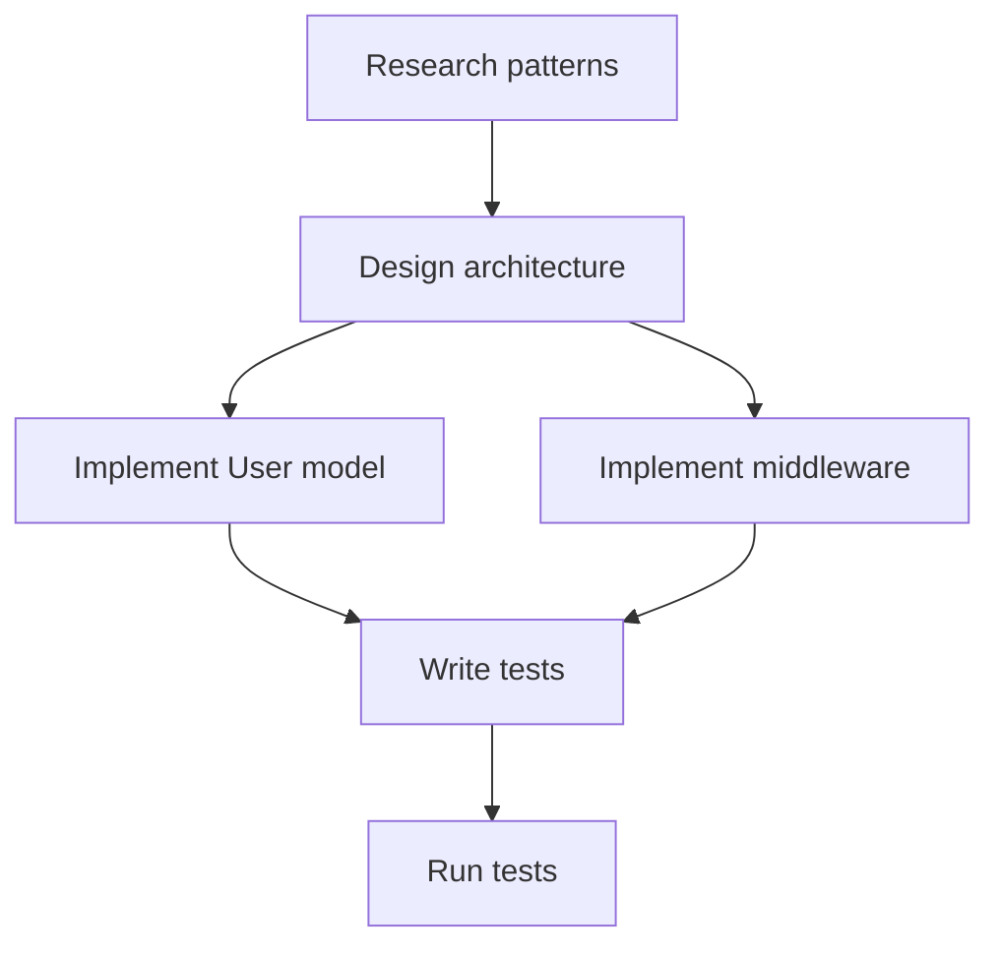

# Multi-Agent Workforce Planner

Design parallel agent workstreams for large feature implementations by analyzing dependencies, assigning specialized agents, and maximizing parallelization.

## When to Use

- Breaking down large features into parallel work
- Planning multi-file implementations
- Coordinating specialized agent types
- Maximizing development throughput
- Managing complex dependency chains

## Core Framework

```
Feature Spec → Requirements → Dependency Graph → Parallel Streams → Agent Assignment
     ↓              ↓               ↓                  ↓                  ↓
   Input        Breakdown       Identify           Group into        Match to
   Document     into tasks      blockers           workstreams       agent types
```

## Task Granularity

| Level | Description | Typical Scope |
|-------|-------------|---------------|
| Epic | Large feature area | Days to weeks |
| Workstream | Parallelizable track | Hours to days |
| Task | Single work unit | 30min - 2 hours |
| Subtask | Atomic action | 5-30 minutes |

## Agent Type Catalog

| Agent | Specialization | Best For |
|-------|----------------|----------|
| **Explore** | Read-only analysis | Finding files, understanding patterns, codebase research |
| **Plan** | Architecture design | System design, dependency analysis, implementation planning |
| **Bash** | Command execution | Tests, builds, git operations, file system commands |
| **Edit** | File modifications | Implementation, refactoring, code changes |

### Agent Selection Rules

```
Need to understand code? → Explore
Need to design solution? → Plan
Need to run commands?   → Bash
Need to modify files?   → Edit
```

## Planning Process

### Step 1: Decompose Requirements

Break the feature into discrete tasks:

```yaml
feature: "User Authentication System"
tasks:
  - id: T1
    name: "Research existing auth patterns"
    type: research
    agent: Explore

  - id: T2
    name: "Design auth architecture"
    type: design
    agent: Plan
    depends_on: [T1]

  - id: T3
    name: "Implement User model"
    type: implementation
    agent: Edit
    depends_on: [T2]

  - id: T4
    name: "Implement auth middleware"
    type: implementation
    agent: Edit
    depends_on: [T2]

  - id: T5
    name: "Write auth tests"
    type: testing
    agent: Edit
    depends_on: [T3, T4]

  - id: T6
    name: "Run test suite"
    type: verification
    agent: Bash
    depends_on: [T5]
```

### Step 2: Build Dependency Graph



### Step 3: Identify Parallel Opportunities

Tasks without dependencies between them can run in parallel:

```
Phase 1: T1 (solo - must complete first)
Phase 2: T2 (solo - design phase)
Phase 3: T3, T4 (parallel - independent implementations)
Phase 4: T5 (solo - needs both implementations)
Phase 5: T6 (solo - verification)
```

### Step 4: Create Workstreams

Group related tasks into workstreams:

```yaml
workstreams:
  - name: "Core Auth"
    tasks: [T3, part of T5]
    owner: agent-1

  - name: "Middleware"
    tasks: [T4, part of T5]
    owner: agent-2
```

## Parallelization Strategies

### Horizontal Parallelization

Multiple independent features simultaneously:

```
Feature A ─────────────────────>
Feature B ─────────────────────>
Feature C ─────────────────────>
```

### Vertical Parallelization

Different layers of same feature:

```
Frontend  ─────────────>
Backend   ─────────────>
Database  ─────────────>
Tests     ─────────────>
```

### Interface-First Parallelization

Define contracts, implement in parallel:

```
1. Define interfaces/types (blocking)
2. Implement producer and consumer in parallel
```

```yaml
phase1:
  - task: "Define API contract"
    agent: Plan
    blocking: true

phase2_parallel:
  - task: "Implement API server"
    agent: Edit
  - task: "Implement API client"
    agent: Edit
```

### Speculative Parallelization

Start likely-needed work early:

```yaml
main_path:
  - task: "Implement feature"
    agent: Edit

speculative:
  - task: "Prepare test fixtures"
    agent: Edit
    confidence: high  # Will definitely be needed
  - task: "Draft documentation"
    agent: Edit
    confidence: medium  # Might need revision
```

## Progress Tracking

### Status Format

```
Workstream A: [████████░░] 80% (8/10 tasks)
  └─ Blocked: Waiting on API contract from B

Workstream B: [██████████] 100% ✓

Workstream C: [████░░░░░░] 40%
  └─ At Risk: Task 7 failed twice
```

### Task States

| State | Symbol | Meaning |
|-------|--------|---------|
| Pending | ○ | Not started |
| In Progress | ◐ | Currently executing |
| Completed | ● | Successfully finished |
| Blocked | ⊘ | Waiting on dependency |
| Failed | ✗ | Needs intervention |
| Skipped | ⊖ | Intentionally skipped |

### Progress Table

```markdown
| Task | Agent | Status | Blocked By | Notes |
|------|-------|--------|------------|-------|
| T1   | Explore | ● | - | Completed |
| T2   | Plan    | ● | - | Completed |
| T3   | Edit    | ◐ | - | In progress |
| T4   | Edit    | ◐ | - | In progress |
| T5   | Edit    | ○ | T3, T4 | Waiting |
| T6   | Bash    | ○ | T5 | Waiting |
```

## Failure Recovery

### Retry Strategy

```yaml
retry_policy:
  max_attempts: 3
  backoff: exponential
  base_delay: 30s

on_failure:
  - log_error
  - notify_supervisor
  - attempt_recovery
  - escalate_if_exhausted
```

### Recovery Patterns

1. **Retry**: Same agent, same task
2. **Reassign**: Different agent, same task
3. **Decompose**: Break task into smaller subtasks
4. **Skip**: Mark as skipped, continue with downstream
5. **Escalate**: Human intervention required

### Checkpoint Strategy

```yaml
checkpoints:
  - after: phase1
    save: ["contracts", "interfaces"]

  - after: phase2
    save: ["implementations"]
    validate: ["types_match", "tests_pass"]
```

## Workstream Template

```yaml
workstream:
  name: "Feature Name"
  id: WS-001
  owner: agent-type

  objectives:
    - "Primary goal"
    - "Secondary goal"

  tasks:
    - id: T1
      name: "Task description"
      agent: Explore
      estimated: 15min

    - id: T2
      name: "Next task"
      agent: Edit
      depends_on: [T1]
      estimated: 30min

  success_criteria:
    - "All tests pass"
    - "No type errors"

  risks:
    - risk: "Complex integration"
      mitigation: "Early interface definition"
```

## Example: Full Feature Breakdown

### Feature: Add User Profile Editing

```yaml
epic:
  name: "User Profile Editing"

workstreams:
  - name: "Backend API"
    tasks:
      - {id: B1, name: "Research current user model", agent: Explore}
      - {id: B2, name: "Design profile update endpoint", agent: Plan, depends_on: [B1]}
      - {id: B3, name: "Implement PUT /users/:id/profile", agent: Edit, depends_on: [B2]}
      - {id: B4, name: "Add validation middleware", agent: Edit, depends_on: [B2]}
      - {id: B5, name: "Write API tests", agent: Edit, depends_on: [B3, B4]}

  - name: "Frontend UI"
    tasks:
      - {id: F1, name: "Research existing form patterns", agent: Explore}
      - {id: F2, name: "Design ProfileEdit component", agent: Plan, depends_on: [F1]}
      - {id: F3, name: "Implement form component", agent: Edit, depends_on: [F2]}
      - {id: F4, name: "Add form validation", agent: Edit, depends_on: [F3]}
      - {id: F5, name: "Write component tests", agent: Edit, depends_on: [F4]}

  - name: "Integration"
    tasks:
      - {id: I1, name: "Connect frontend to API", agent: Edit, depends_on: [B3, F3]}
      - {id: I2, name: "Write E2E tests", agent: Edit, depends_on: [I1]}
      - {id: I3, name: "Run full test suite", agent: Bash, depends_on: [B5, F5, I2]}

parallel_execution:
  phase1: [B1, F1]  # Research in parallel
  phase2: [B2, F2]  # Design in parallel
  phase3: [B3, B4, F3]  # Implementation
  phase4: [F4, B5]  # Validation + tests
  phase5: [F5, I1]  # More tests + integration
  phase6: [I2]
  phase7: [I3]
```

## References

- `references/dependency-analysis.md` — Identifying task dependencies
- `references/parallelization-strategies.md` — Maximizing parallel work
- `references/agent-type-catalog.md` — Agent capabilities reference
- `references/failure-recovery-patterns.md` — Handling failures
- `references/workflow-integration.md` — Ecosystem integration

## Related Skills

- **product-requirements-designer**: For creating feature specifications
- **verification-loop**: For validating completed work
- **deployment-cicd**: For deployment after implementation
