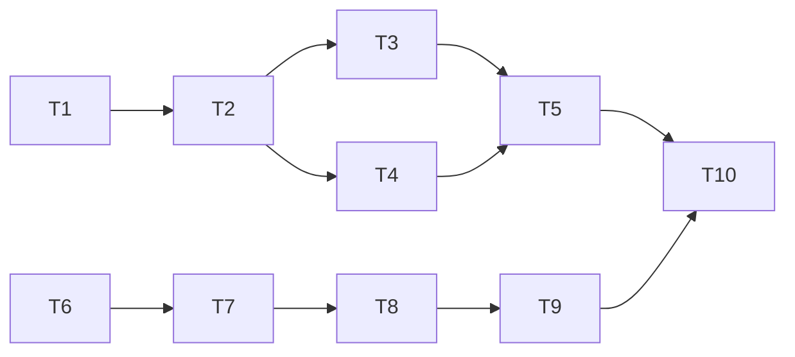

# Workstream Plan: {{FEATURE_NAME}}

> Generated: {{DATE}}
> Status: {{STATUS}}

## Overview

| Field | Value |
|-------|-------|
| **Feature** | {{FEATURE_NAME}} |
| **Epic** | {{EPIC_NAME}} |
| **Priority** | {{PRIORITY}} |
| **Estimated Duration** | {{ESTIMATED_DURATION}} |
| **Workstreams** | {{WORKSTREAM_COUNT}} |
| **Total Tasks** | {{TOTAL_TASKS}} |

### Description

{{FEATURE_DESCRIPTION}}

### Success Criteria

- [ ] {{CRITERION_1}}
- [ ] {{CRITERION_2}}
- [ ] {{CRITERION_3}}

---

## Workstreams

### Workstream A: {{WORKSTREAM_A_NAME}}

**Owner:** {{AGENT_TYPE}}
**Estimated:** {{ESTIMATED_TIME}}

| ID | Task | Agent | Depends On | Status |
|----|------|-------|------------|--------|
| T1 | {{TASK_1}} | Explore | - | ○ Pending |
| T2 | {{TASK_2}} | Plan | T1 | ○ Pending |
| T3 | {{TASK_3}} | Edit | T2 | ○ Pending |
| T4 | {{TASK_4}} | Edit | T2 | ○ Pending |
| T5 | {{TASK_5}} | Bash | T3, T4 | ○ Pending |

**Deliverables:**
- {{DELIVERABLE_1}}
- {{DELIVERABLE_2}}

---

### Workstream B: {{WORKSTREAM_B_NAME}}

**Owner:** {{AGENT_TYPE}}
**Estimated:** {{ESTIMATED_TIME}}

| ID | Task | Agent | Depends On | Status |
|----|------|-------|------------|--------|
| T6 | {{TASK_6}} | Explore | - | ○ Pending |
| T7 | {{TASK_7}} | Plan | T6 | ○ Pending |
| T8 | {{TASK_8}} | Edit | T7 | ○ Pending |
| T9 | {{TASK_9}} | Bash | T8 | ○ Pending |

**Deliverables:**
- {{DELIVERABLE_3}}
- {{DELIVERABLE_4}}

---

## Execution Plan

### Phase 1: Research & Design

```
Parallel:
├── WS-A: T1 (Research) → T2 (Design)
└── WS-B: T6 (Research) → T7 (Design)
```

**Duration:** {{PHASE_1_DURATION}}
**Blocking:** Yes (implementation depends on design)

### Phase 2: Implementation

```
Parallel:
├── WS-A: T3 (Implement) ─┐
│         T4 (Implement) ─┤
└── WS-B: T8 (Implement) ─┘
```

**Duration:** {{PHASE_2_DURATION}}
**Parallelization:** {{PARALLEL_FACTOR}}x

### Phase 3: Verification

```
Sequential:
├── WS-A: T5 (Test)
├── WS-B: T9 (Test)
└── Integration: T10 (E2E Test)
```

**Duration:** {{PHASE_3_DURATION}}

---

## Dependencies

### Internal Dependencies



### External Dependencies

| Dependency | Required By | Status | Owner |
|------------|-------------|--------|-------|
| {{EXT_DEP_1}} | T3 | Pending | {{OWNER}} |
| {{EXT_DEP_2}} | T8 | Complete | {{OWNER}} |

---

## Risk Assessment

| Risk | Likelihood | Impact | Mitigation |
|------|------------|--------|------------|
| {{RISK_1}} | Medium | High | {{MITIGATION_1}} |
| {{RISK_2}} | Low | Medium | {{MITIGATION_2}} |

---

## Checkpoints

| Checkpoint | After Phase | Validation |
|------------|-------------|------------|
| CP-1 | Design | Interfaces defined |
| CP-2 | Implementation | Unit tests pass |
| CP-3 | Integration | E2E tests pass |

---

## Progress Tracking

### Current Status

```
Workstream A: [░░░░░░░░░░] 0%
  └─ Status: Not started

Workstream B: [░░░░░░░░░░] 0%
  └─ Status: Not started
```

### Updates

| Date | Update |
|------|--------|
| {{DATE}} | Plan created |

---

## Notes

{{NOTES}}
