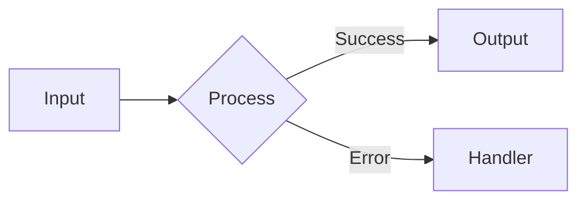

# README Anatomy Guide

Comprehensive guide to creating high-conversion repository READMEs.

---

## The Conversion Funnel

A README should move readers through this funnel:

```
ATTENTION (0-3s)    → Hero catches eye
INTEREST (3-10s)    → Value proposition clear
DESIRE (10-30s)     → Quick start accessible
ACTION (30s+)       → User is running code
```

**Goal:** Reader goes from "What is this?" to `npm install` in under 30 seconds.

---

## Section Anatomy

### 1. Hero Section (The Hook)

**Purpose:** Capture attention, establish credibility, convey value instantly.

**Elements:**
```markdown
# Project Name


[](#) [](#) [](#) [](#)

> One-sentence pitch that explains what this does and why you'd want it.

[Demo](url) | [Docs](url) | [Discord](url)
```

**Badge Order (left to right):**
1. Build status (CI passing = trustworthy)
2. Coverage (tested = reliable)
3. Version (actively maintained)
4. License (legal clarity)
5. Downloads/Stars (social proof - optional)

**Badge Styling:**
- Use `style=flat-square` for professional look
- Use `style=for-the-badge` for marketing emphasis
- Never mix styles in the same row

### 2. Value Section (The Why)

**Purpose:** Answer "Why should I care?" and "Why this over alternatives?"

```markdown
## Why [Project Name]?

**The Problem:** [One sentence describing the pain point]

**The Solution:** [Project Name] does [specific thing] so you can [benefit].

### Key Features

- **Feature 1** - Brief explanation of benefit
- **Feature 2** - Brief explanation of benefit
- **Feature 3** - Brief explanation of benefit
```

**Tips:**
- Lead with benefits, not features
- Be specific about what it does
- Compare to alternatives (tactfully)

### 3. Quick Start (The Win)

**Purpose:** Get user to a working state in minimum steps.

```markdown
## Quick Start

### Install

```bash
npm install project-name
```

### Use

```javascript
import { thing } from 'project-name';

const result = thing.doSomething();
console.log(result); // Expected output
```
```

**Rules:**
- Maximum 5 commands to working code
- Copy-pasteable (no placeholders that break)
- Show expected output
- Include prerequisites only if unusual

### 4. Documentation Section

**Purpose:** Provide paths to deeper learning.

```markdown
## Documentation

- [Getting Started](docs/getting-started.md) - First-time setup guide
- [API Reference](docs/api.md) - Complete API documentation
- [Examples](docs/examples.md) - Common use cases
- [FAQ](docs/faq.md) - Frequently asked questions
- [Troubleshooting](docs/troubleshooting.md) - Common issues
```

**Tips:**
- Use descriptive link text (not "click here")
- Order by user journey (start to advanced)
- Include brief description of each link

### 5. Architecture Section (Optional)

**Purpose:** Help contributors understand the codebase.

```markdown
## Architecture

```
src/
├── core/           # Core business logic
├── adapters/       # External service adapters
├── utils/          # Shared utilities
└── index.ts        # Public API
```

For detailed architecture, see [ARCHITECTURE.md](docs/ARCHITECTURE.md).
```

**When to include:**
- Open source projects seeking contributors
- Complex projects with non-obvious structure
- Projects with specific architectural patterns

### 6. Configuration Section

**Purpose:** Document customization options.

```markdown
## Configuration

| Option | Type | Default | Description |
|--------|------|---------|-------------|
| `timeout` | `number` | `5000` | Request timeout in ms |
| `retries` | `number` | `3` | Number of retry attempts |
| `debug` | `boolean` | `false` | Enable debug logging |

```javascript
const client = new Client({
  timeout: 10000,
  retries: 5,
  debug: true
});
```
```

**Tips:**
- Use tables for scanability
- Show types and defaults
- Include usage example

### 7. Contributing Section

**Purpose:** Welcome contributions and set expectations.

```markdown
## Contributing

Contributions are welcome! Please see our [Contributing Guide](CONTRIBUTING.md).

### Quick Start for Contributors

```bash
git clone https://github.com/user/repo.git
cd repo
npm install
npm test
```
```

**Tips:**
- Link to detailed CONTRIBUTING.md
- Include quick contributor setup
- Make it feel welcoming

### 8. Footer Section

**Purpose:** Legal, attribution, contact.

```markdown
## License

MIT - see [LICENSE](LICENSE)

## Acknowledgments

- [Library](url) - What we used it for
- [Person](url) - Specific contribution

---

Made with love by [Your Name](https://yoursite.com)
```

---

## Visual Elements

### Mermaid Diagrams

```markdown

```

**When to use:**
- Architecture overviews
- Data flow diagrams
- State machines
- Sequence diagrams

### Dark Mode Images

```html
<picture>
  <source media="(prefers-color-scheme: dark)" srcset="docs/images/diagram-dark.png">
  <source media="(prefers-color-scheme: light)" srcset="docs/images/diagram-light.png">
  
</picture>
```

### Screenshots

**Best practices:**
- Use consistent browser/terminal theme
- Crop to relevant content
- Add captions/annotations
- Compress images (< 500KB ideal)
- Use descriptive alt text

---

## Writing Guidelines

### Tone

| Do | Don't |
|----|-------|
| Be direct and clear | Be overly casual ("Hey guys!") |
| Use active voice | Use passive voice |
| Be confident | Be arrogant |
| Acknowledge limitations | Overpromise |

### Structure

| Do | Don't |
|----|-------|
| Use headers liberally | Wall of text |
| Keep paragraphs short | Long paragraphs |
| Use lists for multiple items | Inline comma lists |
| Use tables for comparisons | Prose for options |
| Use code blocks for code | Inline code for long snippets |

### Code Examples

| Do | Don't |
|----|-------|
| Working, copy-pasteable | Pseudocode |
| Show expected output | Leave output unclear |
| Use realistic data | "foo", "bar", "baz" |
| Highlight key lines | Show everything |

---

## Checklist

### Essential Elements

- [ ] Project name is clear
- [ ] One-sentence description
- [ ] Badges (build, coverage, version, license)
- [ ] Installation instructions
- [ ] Basic usage example
- [ ] License stated

### Polish Elements

- [ ] Logo/banner image
- [ ] Table of contents (if > 4 sections)
- [ ] Screenshots/GIFs
- [ ] Contributing section
- [ ] Links to further docs

### Accessibility

- [ ] All images have alt text
- [ ] Dark mode compatible
- [ ] No color-only information
- [ ] Code is copy-pasteable

### Maintenance

- [ ] No broken links
- [ ] Version numbers current
- [ ] Examples still work
- [ ] No stale information

---

## Anti-Patterns

### The Novel
Too much text, not enough structure. Readers scan, they don't read.

### The Skeleton
Only installation and license. No value proposition, no examples.

### The Changelog
README that's mostly version history. Put that in CHANGELOG.md.

### The Placeholder
"TODO: Add documentation here" - either write it or remove the section.

### The Outdated
Examples that no longer work, badges that show failing builds.

### The Marketing Page
All benefits, no actual documentation. Users need to know HOW.

---

## Templates by Project Type

### CLI Tool
Emphasize: Installation, Commands, Options

### Library
Emphasize: Quick Start, API Overview, Examples

### Framework
Emphasize: Philosophy, Getting Started, Ecosystem

### Application
Emphasize: Features, Demo, Deployment

### API/Service
Emphasize: Authentication, Endpoints, Rate Limits
